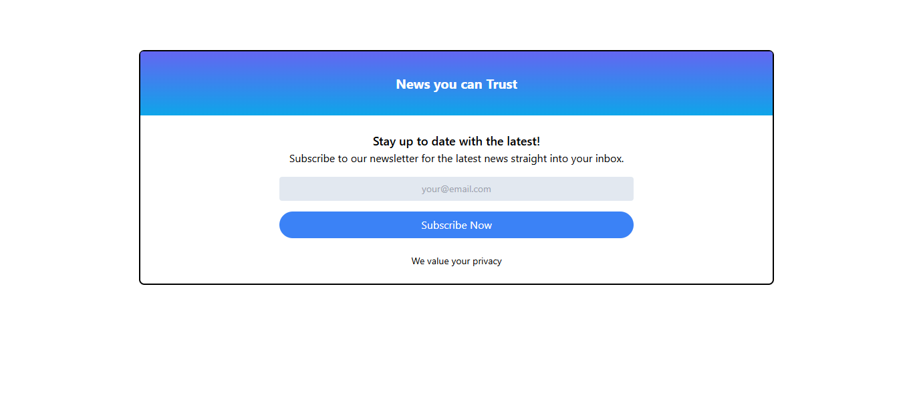

# Tailwind Newsletter UI

A responsive newsletter subscription UI built using Tailwind CSS.  
This project features a clean card layout, gradient header, centered form design, and modern responsive styling using Tailwind utility classes.

---


## 🚀 Features

- Responsive newsletter subscription card
- Gradient header design
- Clean and modern UI
- Styled form input and button
- Flexbox layout using Tailwind CSS
- Utility-first CSS approach

---

## 📸 Screenshot



---

## 🛠️ Tech Stack

- HTML5
- Tailwind CSS

---

## 📂 Project Structure

```bash
tailwind-newsletter-ui/
│
├── index.html
├── style.css
├── package.json
├── tailwind.config.js
├── postcss.config.js
└── node_modules/
```

---

## 📸 Preview

Modern newsletter subscription component with:

- Gradient header
- Email input field
- Rounded subscribe button
- Responsive centered layout

---

## 📚 Learning Outcomes

- Tailwind utility classes
- Flexbox alignment
- Responsive layout design
- Gradient backgrounds
- Form styling in Tailwind
- Spacing and typography utilities

---

## ▶️ Run Locally

Clone the project:

```bash
git clone https://github.com/shanusingh01/tailwind-newsletter-ui.git
```

Go to the project directory:

```bash
cd tailwind-newsletter-ui
```

Install dependencies:

```bash
npm install
```

Start Tailwind build/watch:

```bash
npx tailwindcss -i ./style.css -o ./output.css --watch
```

---

## 🌟 Future Improvements

- Add dark mode
- Add form validation
- Add animations and hover effects
- Make fully mobile optimized

---
